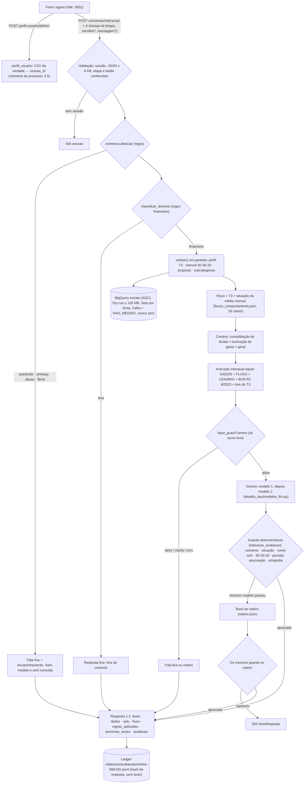
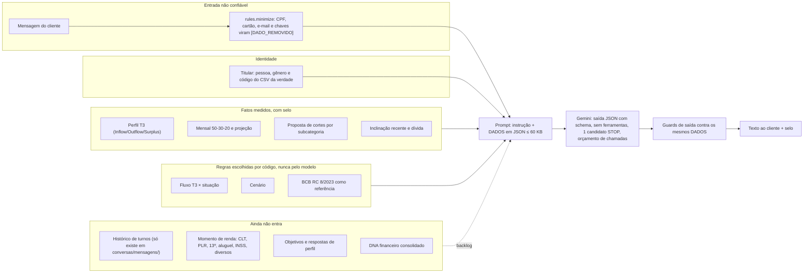

# Backlog do backend i.agora: arquitetura e o que falta

Levantamento de **2026-09-27 às 08:40–08:50 BRT**, feito no código desta pasta. Versão visual, com os mesmos
diagramas: artefato "Mapa i.agora" (link no fecho da sessão). Este documento substitui qualquer lista de
pendências anterior. As pendências de [fluxo-executado-2026-09-27.md §7](fluxo-executado-2026-09-27.md) e de
[controle-da-conversa.md §6](controle-da-conversa.md) estão todas aqui.

Selos usados neste documento:

| Número | Valor | Fonte | Data |
| --- | --- | --- | --- |
| Distribuição T3 (n = 1.000) | Vulnerável 45,3 % · Esbanjador 28,6 % · Livre 26,1 % | [t3-e-resposta.md](estudo-i-agora/t3-e-resposta.md) | 2026-09-27 |
| Interações avaliadas | 54, todas aprovadas; 32 modelo, 10 roteiro, 10 fora do contexto, 2 dados | `relatorios/avaliacoes/2026-09-27.jsonl` (06:10–06:51) | medido 08:42 |
| Falhas do provedor | 20 tentativas com HTTP 429 (cota); 2 reprovações por ortografia | mesmo ledger | medido 08:42 |
| Tempo total por interação | p50 2.587 ms · p90 4.694 ms | mesmo ledger | medido 08:42 |
| Interações por T3 | Vulnerável 29 · Esbanjador 12 · NAO_MEDIDO 10 · Livre 3 | mesmo ledger | medido 08:42 |
| Suíte | 346 testes OK + 3 expected failures às 09:07 (medido pela f7; às 09:01 eram 344). Novos: `test_quatro_rotas` (28), `test_corpus_intencao_gemini` (5), `test_guard_situacao_abstencao` | `python -m unittest discover -s tests` | 2026-09-27 |

## 1. Caminho de uma interação, da entrada à saída

Rota principal do front: `POST /api/v1/context-agent/conversas/interacao/` ([views_interacao.py](../apps/conversas/views_interacao.py) →
[interacao.py](../apps/conversas/interacao.py) `interagir`).

## 2. Controle de contexto: o que entra no modelo

### As quatro rotas de conversa

| Rota | Dados do cliente | Memória | Guards | Estado |
| --- | --- | --- | --- | --- |
| `primeira-chamada/` | nenhum (só o texto inicial) | nenhuma | nenhum | usada pelo inspetor do front |
| `enviar-mensagem/` | **cliente demo do SQLite** | 8 registros em `ConversaAgenteSessao` | filtro de vazamento por texto | ver I1: chamou o usuário 928 de "Eduarda" |
| `conversas/mensagens/` | usuário real (BigQuery) com selo | 12 turnos em memória do processo | input guard + output guard Gemini + regras | envelope 1.0 |
| `conversas/interacao/` | usuário real (BigQuery) com selo | **nenhuma entre chamadas** | guards determinísticos + roteiro | rota principal do front |

## 3. Os pontos pedidos, ligados ao código

| Ponto pedido | Onde já existe | Estado |
| --- | --- | --- |
| Linhas de atuação por comportamento | `fluxos_comportamento.json`: 16 fluxos T3 × situação com `proximo_passo` e regra BCB | Existe |
| 2a. Evidência da base | selo por fonte (`usuario_real`), `guard_numeros`, guard factual do estudo i.agora | Existe |
| 2b. Impacto individualizado | `plano_proposta` (corte até Surplus 15 %), `interacao_dados.projetar` | Existe, sem objetivo pessoal (F4) |
| Categoria conforme intenção | só `financeiro`/`fora`, identidade e regex de gasto | Parcial (F3) |
| Categoria conforme dados | discricionário, subcategorias e inclinação | Existe |
| Regra 50-30-20 | `regra_50_30_20` + `guard_50_30_20` | Existe |
| Gastos por categoria → perfis | visões categoria e discricionário; perfil é só o T3 | Parcial (F2) |
| Dashboard Finanças | `home.visao_conta` com 3 números | Falta (F6) |
| DNA individualizado | peças soltas em `dados` | Falta (F2) |
| Desenhar o comportamento do modelo | `interacao.liquid`, `ETAPAS[*].objetivo`, `guard_tom` | Existe |
| Análise inicial, perguntas-chave, objetivos pessoais | nada | Falta (F4) |
| Perfil pelas movimentações | T3 no SQL (`visao_perfil_t3.sql`) | Existe |
| Momento financeiro (freelancer, PLR, aluguel, INSS) | `visao_renda.sql` separa só CLT / diversos / outras, e a visão não chega ao prompt | Falta (F1) |
| Histórias de comportamento por perfil | 16 fluxos; nenhuma história por perfil × momento | Parcial (F5) |
| T3 por Inflow/Outflow/Surplus | SQL + distribuição selada 45,3 / 28,6 / 26,1 | Existe |

## 4. Backlog

Classes: **BUG** quebra agora ou mente ao cliente · **DEMO** risco concreto na apresentação · **PRÓXIMO**
funcionalidade pedida, sem dependência externa · **FUTURO** fica para depois, com a justificativa escrita ·
**DECISÃO** depende do dono.

### Imediato

- [x] **I1 · BUG · `enviar-mensagem/` usa o cliente demo.** Onde: `services/agente_service.py`, `agentes/agente.py`. Por quê: com o usuário 928 a resposta chamou a pessoa de "Eduarda" ([fluxo-executado §6](fluxo-executado-2026-09-27.md)). São três motores de conversa e um deles afirma uma identidade errada. Fazer: a rota responde 410 e aponta para `conversas/interacao/`, e o código vai para `archive/` com linha no índice. Pronto quando: teste chama a rota e recebe 410.
  - **Resolvido (D-3), conferido 2026-09-27 09:49 BRT:** a rota responde 410 Gone com JSON apontando `conversas/interacao/` (`apps/context_agent_datadriven/views.py:67-78`, montada em `urls.py:18`); o código antigo está em `archive/2026-09-27/`, com linha no `archive/INDICE.md`. Teste: `tests/test_d3_rota_unica.py:65` (`test_410_com_json_para_todo_metodo`). `scripts/primeira_interacao.py` passou a usar `perfil-usuario/definir/` + `conversas/interacao/` (09:47).
- [x] **I2 · BUG · Cota do Gemini (429).** Onde: `desafio_itau/modelos_llm.py` (`MODELOS_GOOGLE` começa em `gemini-flash-latest`), `interacao._gerar`, `_guard_entrada`. Por quê: 20 tentativas com 429 em 54 interações; 10 respostas caíram no roteiro. O turno livre gasta até 3 pedidos (input guard + 2 modelos). Fazer: pôr primeiro o modelo com cota, contar pedidos por interação no ledger e mostrar a contagem em `avaliacoes/resumo/`. Pronto quando: o resumo traz `pedidos_por_interacao` e a taxa de 429.
  - **Feito pela f7, conferido 2026-09-27 09:49 BRT:** `MODELOS_GOOGLE` começa por `gemini-3.5-flash-lite` (`desafio_itau/modelos_llm.py:22`). Ressalva: o critério "Pronto quando" (`pedidos_por_interacao` e taxa de 429 em `avaliacoes/resumo/`) é NAO_MEDIDO: não há nenhuma ocorrência de `pedidos_por_interacao` em `apps/conversas/` às 09:49.
- [ ] **I3 · DEMO · Consulta ao BigQuery em toda interação.** Onde: `interacao.coletar`, `interacao_dados.consultar_mensal`, `plano_proposta.proposta`. Por quê: só `usuario_real.perfil` tem cache (900 s). A consulta mensal e a proposta rodam a cada clique, inclusive nas etapas sem número (`bot.intro`, `bot.finish`, `user.ajustar`). p50 2,6 s e p90 4,7 s. Fazer: cache por (UUID, data de corte), igual ao do perfil, e não coletar quando a etapa tem `numeros: False`. Pronto quando: um teste com executor falso conta 1 consulta em 2 interações seguidas.
- [~] **I4 · DEMO · Sessão some quando o servidor reinicia.** Onde: `perfil_usuario._sessoes` e `ConversationService.sessions`, ambos em memória do processo. Por quê: o `runserver` recarrega a cada arquivo salvo, e cada recarga invalida o `sessao_id` do front, que passa a receber 404 `sessao`. Às 08:39–08:43 outra sessão estava editando `apps/conversas/`, então isso acontece durante o trabalho normal. Fazer: gravar a sessão no SQLite (tabela própria) ou fazer o front chamar `definir/` de novo ao receber 404. Na demo, subir com `--noreload`. Pronto quando: um teste reinicia o serviço e a sessão continua válida.
  - **Parcial, conferido 2026-09-27 09:49 BRT:** o lado do `perfil_usuario` está feito (D-4): model `SessaoPerfilUsuario` (`apps/context_agent_datadriven/models.py:64`), migração `0002_sessao_perfil_usuario.py`, teste `tests/test_d4_sessao_persistente.py:74` (`test_sessao_sobrevive_ao_reinicio`, com prova negativa em `:82`). O `ConversationService.sessions` (`apps/conversas/`) segue em memória e está com a f7 (aprovado às 09:41). No Cloud Run o SQLite é efêmero: ver `decisoes-e-logica-2026-09-27.md` §5.3, item 5.
- [ ] **I5 · DEMO · Turno livre sem memória.** Onde: `conversas/interacao/`. Por quê: cada POST é isolado. "E em fevereiro?" perde o referente. O histórico existe só em `conversas/mensagens/`. Fazer: guardar os últimos 4 turnos por `sessao_id`, mandar como `HISTORICO` marcado como dado não confiável e incluir no `contexto_guard`. Pronto quando: um teste com a pergunta de seguimento mostra o referente certo.
- [ ] **I6 · DEMO · Livre quase não foi testado.** Onde: ledger de avaliações. Por quê: 3 de 54 interações foram de Livre, que é 26,1 % da base. Os fluxos `LIV-*` não têm prova de campo. Fazer: bateria com 2 usuários reais por T3 × situação (até 24 casos) pelo `scripts/primeira_interacao.py`, gravada em `datasets/`. Pronto quando: cada fluxo com usuário na base tem pelo menos 1 interação aprovada no ledger.
- [ ] **I7 · DECISÃO · Esta pasta não tem git.** Por quê: os commits foram para outro clone (`desafio-itau-batalha-de-agentes-time2`). As rotas `perfil-usuario` e `conversas` estão fora desse git ([fluxo-executado §7](fluxo-executado-2026-09-27.md)). Fazer: o dono escolhe o repositório de verdade. Pronto quando: `git status` roda nesta pasta ou ela vai para `archive/`.
- [ ] **I8 · BUG · Detector de extremos perde sofrimento indireto.** Onde: `apps/conversas/extremos.py`. Por quê: no corpus do Gemini (`datasets/corpus-intencao-gemini-2026-09-27T0857.jsonl`), pegou 3 de 12 frases, e nenhuma das 3 de sofrimento indireto ("vontade de sumir"). "odeio esse banco e odeio voce" caiu em financeiro. Fazer: acrescentar os termos com prova negativa ("sumir com essa dívida" não é extremo) e revisar à mão os 60 rótulos dados pelo Gemini. Pronto quando: extremo acerta ≥ 10 de 12 e o piso em `tests/test_corpus_intencao_gemini.py` sobe de 25 % para 83 %. Está com a f7, item 5, à espera do OK do dono dela.
- [x] **I9 · BUG · Chave do Gemini na query string.** Onde: `agentes/LLM_Models/google/cliente.py:50` (`...:generateContent?key=`). Por quê: log de acesso, proxy ou traceback gravam a chave. `apps/conversas/gateway.py:62` já usa o cabeçalho `x-goog-api-key`. Fazer: usar o cabeçalho ou arquivar junto com a I1. Pronto quando: um teste com o transporte simulado confirma que a URL não contém `key=`.
  - **Resolvido (D-3/I9), conferido 2026-09-27 09:49 BRT:** a chave vai no cabeçalho `x-goog-api-key`, nunca na URL (`apps/context_agent_datadriven/agentes/LLM_Models/google/cliente.py:50-55`). Testes: `tests/test_d3_rota_unica.py:93` (URL sem `key=`), `:102` (prova negativa do verificador) e `:105`/`:112` (varredura AST do código vivo).
- [x] **Resolvido às 09:07 pela f7: roteiro NAO_MEDIDO reprovado pelo `guard_situacao`.** O texto "não vou afirmar se sobrou ou faltou" (`fluxos_comportamento.json:58`) gerava 503 sem texto. A f7 criou uma exceção estreita para abstenção, com prova negativa. Teste: `tests/test_guard_situacao_abstencao.py`.
- [ ] **I10 · TESTE · A suíte grava sessões no `db.sqlite3` real.** Onde: `tests/test_perfil_usuario.py` e `tests/test_conversas_http.py` (`unittest.TestCase` puro, sem banco de teste). Por quê: desde a D-4 a sessão vai para a tabela `SessaoPerfilUsuario`, e cada rodada da suíte deixa linhas no banco de desenvolvimento. Medido: cada rodada da suíte soma **33 linhas** em `context_agent_datadriven_sessaoperfilusuario` (74 → 107 às 09:49–09:50 BRT; 173 → 206 às 09:53–09:54 BRT, contagem direta no `db.sqlite3`). A tabela `conversas_sessao_cache` da f7 também cresceu (10 → 12) na mesma rodada; outra sessão pode ter rodado testes ao mesmo tempo, então essa parte é indicativa. Fazer (só registrado, não corrigido): banco de teste (`django.test.TestCase`) ou `SQLITE_PATH` temporário. Pronto quando: a contagem de `sessaoperfilusuario` for igual antes e depois da suíte.
- Provas das 4 rotas: `tests/test_quatro_rotas.py`. As I1 e I5 estão escritas como `expectedFailure` e ficam verdes quando forem corrigidas.

### Próximo: os pontos pedidos

- [ ] **F1 · PRÓXIMO · Momento financeiro pela origem da renda.** Onde: `sql/visao_renda.sql`, `context.FATOS_EXTRATO`, `interacao.coletar`. Por quê: a base tem as entradas `Salario CLT`, `Recebimentos diversos`, `Recebimento Aluguel`, `13o salario`, `Bonus PLR` e `Beneficio INSS` (`docs/estudo-i-agora/medicoes/2026-09-27/q02_categorias.json`). A visão atual junta tudo em CLT / diversos / outras, e nem isso chega ao prompt. Fazer: somar por subcategoria de entrada e derivar `momento` ∈ {renda fixa CLT, renda variável/freelancer, benefício INSS, renda passiva de aluguel, evento sazonal PLR/13º}, com a volatilidade já medida. Levar para DADOS e para o guard de números. Pronto quando: o SQL tem teste com prova negativa (usuário só CLT não vira freelancer) e a distribuição dos momentos está selada.
- [ ] **F2 · PRÓXIMO · DNA financeiro individualizado.** Onde: novo `interacao_dados.dna(dados)`. Por quê: T3, situação, momento (F1), dívida, inclinação, maior desejo e volatilidade já existem soltos em `dados`. Nenhum objeto único descreve a pessoa, e o fluxo usa só dois eixos. Fazer: um objeto `dna` versionado, com selo de cada eixo e `NAO_MEDIDO` por eixo, devolvido na resposta 1.1 e usado para escolher o fluxo. Pronto quando: dois usuários com o mesmo T3 e momentos diferentes recebem fluxos diferentes em teste.
- [ ] **F3 · PRÓXIMO · Categoria conforme a intenção.** Onde: `interacao_cenarios.classificar_dominio`, `INTENCAO_GASTO`, `perfil_usuario.classificar`. Por quê: hoje há só `financeiro`/`fora`, identidade e uma regex de gasto. Fazer: uma taxonomia determinística (consultar gasto, cortar, reserva, dívida, objetivo, identidade, fora), gravada no ledger, que escolhe o cenário. Pronto quando: há um conjunto rotulado de 30 frases com acerto medido.
- [ ] **F4 · PRÓXIMO · Análise inicial, perguntas-chave e objetivos.** Onde: nova etapa `perfil.perguntas` em `interacao.ETAPAS` e no `roteiro.json`. Por quê: o impacto individualizado (2b) calcula o corte, mas não sabe para que a pessoa quer o dinheiro. Fazer: 3 perguntas (objetivo, prazo, prioridade). As respostas ficam na sessão como `user_reported`, separadas do que foi medido, como a projeção já faz, e nunca passam pelo guard de números como fato. Depende de I4. Pronto quando: a proposta cita o objetivo declarado e o guard reprova um objetivo inventado.
- [ ] **F5 · PRÓXIMO · Histórias de comportamento por perfil.** Onde: `datasets/` e `tests/`. Por quê: os 16 fluxos cobrem T3 × situação, mas não a diferença entre, por exemplo, um Vulnerável com INSS e um Vulnerável freelancer. Fazer: uma história por T3 × momento, com um usuário real da base, pergunta, dados selados e resposta esperada. Cada história vira caso de teste. Depende de F1.
- [ ] **F6 · FUTURO · Dashboard Finanças.** Onde: nova rota `usuario-real/<ref>/dashboard/`. Por quê: a home mostra 3 números e o rótulo "Dezembro/25" é constante do front. Justificativa para esperar: o front ainda não consome `controle-conversa/`. Fazer: 50-30-20 atual contra a referência, gasto por categoria, T3 e momento, tudo com selo.

### Futuro, com justificativa

- [ ] **P1 · FUTURO · Segurança de produção.** `DEBUG=True`, `ALLOWED_HOSTS=['*']`, CORS aberto e DRF sem autenticação (`desafio_itau/settings.py`). Justificativa: protótipo local. Obrigatório antes de expor uma chave paga.
- [ ] **P2 · FUTURO · `rotas_base.yaml` não é lido.** `parse_simple_yaml` devolve um dicionário fixo. Mudar o YAML não muda nada. Fazer: ler o YAML de verdade ou mandar o arquivo para `archive/`. Só serve ao `enviar-mensagem` (I1).
- [ ] **P3 · FUTURO · `groundedness_score` é null no harness geral.** A fidelidade é medida só em `conversas/interacao/`. Resolve-se sozinho se I1 arquivar o harness.
- [ ] **P4 · FUTURO · Custo do BigQuery NAO_MEDIDO.** São ~192 MB por perfil frio e o preço não foi calculado. I3 reduz o volume.
- [ ] **P5 · DECISÃO · Score CTX-* contra T3.** O `BehavioralScoreEngine` (750/450) só existe para o cliente demo; para o usuário real, `dados.score` é `NAO_MEDIDO`. Decidir entre arquivar o score para o usuário real ou derivá-lo do T3.
- [ ] **P6 · DECISÃO · Limiar Livre de 15 %.** Mudar 5 pontos move entre 16 % e 19 % da base ([t3-e-resposta.md](estudo-i-agora/t3-e-resposta.md)). É decisão de negócio.
- [ ] **P7 · FUTURO · Regra de 3 compromissos não validada.** `plano_proposta` escolhe no máximo 3 cortes, por gula. A escolha não foi validada com o dono ([controle-da-conversa §5a](controle-da-conversa.md)).

## 5. Ordem sugerida

I2 e I4 primeiro, porque derrubam a demo. Depois I3 e I1. F1 → F2 → F5 formam a narrativa pedida (momento → DNA →
histórias). F3 e F4 vêm em seguida, e F4 depende de I4.

## Decisões para fechar a entrega (levantadas em 2026-09-27 09:20 BRT)

Travam a entrega:

| # | Decisão | Recomendação | Constatação | Quem |
|---|---|---|---|---|
| D-1 | Regra T3 oficial | Manter a de produção (45,3/28,6/26,1 %). A especificação nova (84,1/2,3/5,2 % e 8,4 % sem segmento) fica registrada nos testes `test_spec_*` | Com a especificação, 9 em cada 10 clientes recebem o tom de Vulnerável. Medido no BigQuery às 09:17, `q_spec_diagnostico.json` | Dono |
| D-2 | Diagnóstico populacional a publicar | O medido, com selo | N=316 é a coorte com déficit em dezembro, o que contradiz os 28,8 %. Nenhum corte reproduz 28,8, 19,6 ou 48,4 % | Dono |
| D-3 | Rota do front | Só `conversas/interacao/`; `enviar-mensagem/` vai para archive/ | I1 (Eduarda) e I9 (chave na URL) | Dono + front |
| D-4 | Duração da sessão | 4 h em tudo, com a sessão gravada (I4) | D3: 30 min contra 4 h | Dono |
| D-5 | CSRF porta 3000/3001 | Aceitar as duas | D12 | Dono + front |
| D-6 | Lista de extremos (item 5 da f7) | Aprovar, com prova negativa | I8: pegou 3 de 12 frases de crise | Dono da f7 |
| D-7 | Repositório oficial | Escolher um e copiar o que só existe localmente. **Feito:** cb9d8c8 pushado em feat/decisoes-d3-d7-deploy-2026-09-27 às 10:17 do dia 27/09. Handoff: docs/handoff-backend-2026-09-27.md | I7 | Dono |
| D-8 | Cloud Run | Só depois de D-3, D-4, D-5 e D-7 | Regra do front | Dono + Henrique |

Podem ficar para depois:
- D-9: "Juros pagos" como gatilho de Vulnerável (atinge 695 de 1000 clientes).
- D-10: proxy de cheque especial (a base não tem a categoria).
- D-11: quem fica sem segmento.
- D-12: fórmula dos scores. O 100,0 é saturação da conta.
- D-13: janela de referência (dezembro × média jan–nov).
- D-14: memória no turno livre (I5).
- D-15: contrato de `interacao/` e as divergências D5–D9.
- D-16: Open Finance.

Detalhe e fontes: `docs/rota-integrada-batalha-agentes-backend.md`, `docs/estudo-i-agora/medicoes/2026-09-27/q_spec_diagnostico.json`.
- D-17: o Livre pode ser orientado a investimento? A especificação pede; `interacao.liquid:18` e o guard (`interacao_avaliacao.py:284-286`) proíbem. Recomendação: manter a proibição na entrega (BCB RC 8/2023).
- D-18: tom do Esbanjador, "provocativo" (especificação) ou "direto e encorajador" (`t3.py:123`). Recomendação: direto, falando de trade-offs, sem provocar.
- D-19: separar má dívida de boa dívida. `t3.py:46-47` e `interacao_dados.py:94` tratam financiamento como dívida relevante.

Suítes da especificação (09:26 BRT): `metricas_fluxo.py` e 6 arquivos `tests/test_spec_*.py`, com 105 testes (85 OK e 20 expectedFailure, que registram as divergências da especificação). Suíte completa: 470 OK, com 23 expectedFailure.
