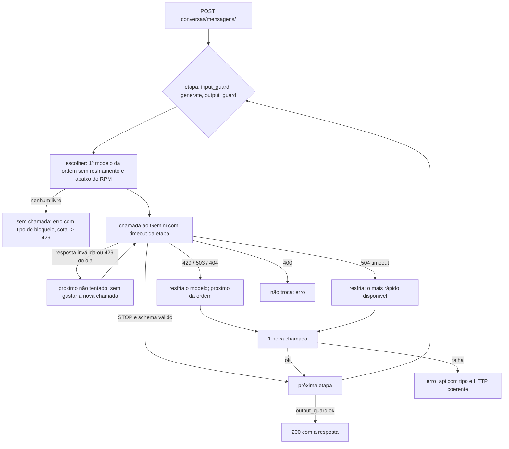

# Raiz rotativa das chamadas: rotação dos modelos Gemini por consumo

Como as chamadas do agente de conversa (`conversas/mensagens/`) são distribuídas entre os modelos Gemini da chave do
projeto, e porquê. Qualquer sessão que mexa em modelos segue esta lógica e altera **dados**, não código.

- Fonte de verdade: [`desafio_itau/politica/cotas-gemini-v1.json`](../desafio_itau/politica/cotas-gemini-v1.json)
  (1.0.0). Código que a lê: [`apps/conversas/roteador.py`](../apps/conversas/roteador.py); quem chama:
  `GeminiGateway._call_roteado` em [`apps/conversas/gateway.py`](../apps/conversas/gateway.py).
- Política de erros (quantas novas chamadas, o que o front recebe):
  [`desafio_itau/politica/erros_api-v1.json`](../desafio_itau/politica/erros_api-v1.json) 1.3.0.
- Criado em 2026-09-27 13:10 BRT (backend-22). Histórico: [`backend-unico-2026-09-27.md`](backend-unico-2026-09-27.md) §4.1-§4.2.

## 1. Consumo de um turno de conversa

Um turno = uma mensagem do usuário = **3 chamadas** no caminho feliz, mais no máximo 1 troca por etapa pelo router.

| etapa | chamadas | tokens medidos | latência medida (sucesso) | fonte · hora BRT |
|---|---|---|---|---|
| `input_guard` | 1 (+trocas, §4) | prompt 365-370, saída 44, pensamento 104-120, total 510-529 (gemini-3.1-flash-lite, n=4) | 1312-6172 ms; 1 timeout (>10 s) em 8 | sondas 12:58-13:21; status :8000 13:09 e :8013 |
| `generate` | 1 (+trocas, §4) | depois da abertura: prompt 8197-8726, pensamento 107-1026, saída 213-260, total 9046-9786 (gemini-3.1-flash-lite, n=3) | 2719-14938 ms (3.1-flash-lite); 1969 ms (3.5-flash-lite) | :8013 13:02-13:22; §4 11:44 |
| `output_guard` | 1 (+trocas, §4) | prompt 7670, pensamento 490 → cortado no teto antigo de 512 (3.1-flash-lite); total 8038 (3.6-flash) | 1640-1844 ms (3.6-flash); 3.1-flash-lite: 2 timeouts de 10 s em 3 | :8013 13:02-13:22 |

Com a abertura, o `generate` e o `output_guard` levam ~8-9 mil tokens de entrada; o `gemini-3.1-flash-lite` fica lento
(generate até 14,9 s, output_guard em timeout 2/3), e o turno medido às 13:22 levou **31,9 s** (5 chamadas). Teto de
saída (`maxOutputTokens`, que inclui o pensamento): guards 2048, generate 4096 (antes 512/1800; o 512 cortava o JSON).

Pior caso por turno: até 4 chamadas por etapa (uma por modelo da ordem), limitadas pelo prazo do turno. O teto de tempo é o do serviço, 45 s (`ConversationService.timeout`), abaixo dos 50 s
do front; o que passar disso sai 504 `timeout_provedor`.

**A conta que motivou a distribuição:** o limite por usuário é 6 mensagens/min; 3 chamadas × 6 msg/min = **18
chamadas/min > 15 RPM** do `gemini-3.5-flash-lite` (painel). Com tudo num só modelo, um único usuário ativo estoura o
RPM. Pondo os dois guards noutro modelo, o principal recebe 6/min (só o `generate`) e o `gemini-3.1-flash-lite`
recebe 12/min — ambos abaixo de 15. Além disso, às 12:39 o principal tinha **486/500** do RPD usado: os guards
consumiam 2/3 dessa cota.

## 2. Cota por modelo × papel

Painel AI Studio "Limites de taxa por modelo" (uso máximo dos últimos 28 dias / limite), colado pelo dono às 12:39 BRT.
**Não medido pelo backend** (a API não expõe cota restante). IDs confirmados por `GET v1beta/models` às 12:40 BRT.

| modelo (ID) | RPM uso/limite | TPM uso/limite | RPD uso/limite | papel | por quê |
|---|---|---|---|---|---|
| gemini-3.5-flash-lite | 16/15 | 92.290/250.000 | 486/500 | 1º no `generate` | modelo principal homologado; p50 1250 ms (n=34) |
| gemini-3.1-flash-lite | 1/15 | 7/250.000 | 1/500 | 1º nos guards; 2º no `generate` | cota livre, mesmo RPM/RPD do principal; sonda 200 |
| gemini-3.6-flash | 0/5 | 0/250.000 | 0/20 | 2º nos guards; 3º no `generate` | sonda 200 em 1375 ms (o mais rápido): destino de timeout |
| gemini-3.5-flash | 3/5 | 17.600/250.000 | 19/20 | último em todas | contingência antiga; parou até o timeout (3/3) antes do 429 |

## 3. Ordem por etapa e como alterá-la

```json
"input_guard":  ["gemini-3.1-flash-lite", "gemini-3.6-flash", "gemini-3.5-flash-lite", "gemini-3.5-flash"],
"output_guard": ["gemini-3.1-flash-lite", "gemini-3.6-flash", "gemini-3.5-flash-lite", "gemini-3.5-flash"],
"generate":     ["gemini-3.5-flash-lite", "gemini-3.1-flash-lite", "gemini-3.6-flash", "gemini-3.5-flash"]
```

Mudar a ordem = editar `router.etapas` no JSON. O carregador (`roteador.validar`) recusa etapa sem ordem e modelo
com `apto: false` (prova negativa em `tests/test_roteador_e_erros_tipo.py`). O processo lê o ficheiro uma vez: depois de
alterar, reinicie o servidor.

**Adicionar um modelo:**

1. Confirmar o ID em `GET https://generativelanguage.googleapis.com/v1beta/models` (tem de listar `generateContent`).
2. Sondar com o **corpo real** de cada etapa (system_instruction + `responseJsonSchema` + `thinkingConfig`): 1 chamada.
   Guardar http, latência e nota em `modelos.<id>.sonda`. Conferir que a saída **valida** no schema estrito
   (`GuardDecisionV1` / `AgentDraftV1`), não só que é JSON: o `gemini-3.1-flash-lite` devolvia JSON bem formado com
   `policy_version` errado.
3. Copiar os números do painel para `modelos.<id>.painel` com a hora; `latencia_ref_ms` = latência medida.
4. `apto: true` só com sonda 200 e schema válido; incluir o ID em `router.etapas`.
5. Rodar a suíte (`.venv/Scripts/python -m unittest discover -s tests`). O router não consulta `ALLOWED_MODELS` do
   gateway (`MODELOS_GOOGLE` em `desafio_itau/modelos_llm.py`); essa lista só vale para o caminho sem router
   (`CONVERSAS['ROTEADOR']=False` e a rota `interacao/`).

**Retirar um modelo:** tirá-lo de `router.etapas` e pôr `apto: false` com a nota medida (não apagar a entrada).

## 4. Regras por erro

| o que aconteceu | próxima ação | resfriamento do modelo | o front recebe (se ninguém responder) |
|---|---|---|---|
| 429 cota diária (`quotaId` …PerDay…) | próximo da ordem com cota | 900 s | HTTP 429 `cota_provedor`, `Retry-After: 30` |
| 429 cota por minuto | próximo da ordem com cota | `retryDelay` do Google (60 s se não vier) | idem |
| 503 / 5xx | próximo da ordem | 30 s | HTTP 503 `provedor_indisponivel` |
| 504 / timeout local (guards 10 s, generate 15 s) | o de menor `latencia_ref_ms` | 60 s | HTTP 504 `timeout_provedor` |
| 404 (modelo retirado) | próximo da ordem | 3600 s | HTTP 503 `provedor_indisponivel` |
| 400 (pedido nosso inválido) | **não troca** | nenhum | HTTP 503 |
| resposta inválida do modelo: HTTP 200 com finishReason ≠ STOP (ex.: MAX_TOKENS), JSON inválido ou fora do schema | próximo da ordem ainda não tentado, **sem gastar** a nova chamada da política | nenhum | HTTP 503 `resposta_modelo_invalida` (linha 503) |

- Erro HTTP: no máximo **1 nova chamada** por etapa (`erros_api-v1.json`, `novas_chamadas_max`); nunca o mesmo pedido
  ao mesmo modelo. **Não gastam** essa nova chamada (1.3.0): resposta inválida do modelo e 429 de cota **diária**
  (recusa sem processar, 360-515 ms; é a mesma informação do resfriamento, descoberta num processo recém-iniciado).
- **Prazo do turno:** o serviço marca `PRAZO_TURNO` = início + 45 s; uma nova tentativa só começa se o timeout da etapa
  couber antes do prazo; senão sai o erro da tentativa anterior.
- Modelo em resfriamento é **pulado sem chamada** (não gasta orçamento nem latência). Todos bloqueados: nenhuma
  chamada e o erro com o tipo do bloqueio (cota → 429).
- **Contador de RPM do processo:** cada chamada real entra numa janela de 60 s por modelo; com `RPM do painel − 1`
  (`rpm_margem`) chamadas na janela, o modelo é tratado como sem cota e o router desvia **antes** do 429. Vale só
  para este processo (dois processos com a mesma chave não se veem).
- **Auditar:** `GET /api/v1/context-agent/conversas/status/` →
  `roteador.ordem_por_etapa`, `roteador.ultimo_modelo_por_etapa` (todas as etapas; null = nenhuma resposta válida),
  `roteador.ultima_tentativa_por_etapa {modelo, resultado}` (inclui falha: `429:dia`, `resposta_invalida:MAX_TOKENS`…),
  `roteador.proximo_por_etapa`, `roteador.resfriamentos {modelo: {restam_s, motivo}}`,
  `roteador.rpm_no_processo`, `cota_diaria_esgotada`, `ultimas_chamadas[] {stage, model, model_version, latency_ms,
  outcome, total_tokens, nova_chamada, tratamento_erro, error_type, motivo_invalida, http_status}`.



## 5. Modelos excluídos (medido)

| modelo | motivo · hora BRT |
|---|---|
| gemini-3-flash-preview | 200, mas 14.937 ms: acima do timeout de guard (10 s) · 12:41 |
| gemini-3.7-flash | 503 UNAVAILABLE depois de 26 s · 12:42 |
| gemini-flash-latest (serve gemini-3.8-flash) | 429 cota diária; painel 26/20 RPD · 12:31 |
| gemini-2.5-flash-lite, gemini-2.5-flash | listados em /models, mas `generateContent` 404 · 12:41 |
| gemma-4-26b-a4b-it, gemma-4-31b-it | 400 com o corpo real (system_instruction/schema/thinking); TPM 16.000 · 12:42 |
| Gemini 2 Flash, 2 Flash Lite, 2.5 Pro, 3.1 Pro | sem cota no painel |

## 6. Limites e decisões pendentes

- **Cota diária × "aguarde 30 s" (decisão do dono):** com todos sem cota do dia, o front ouve "aguarde 30 s", mas a
  cota volta à meia-noite do Pacífico (≈04:00 BRT, NAO_MEDIDO). Opções: linha própria na política para cota diária;
  chave paga ou separada por processo.
- **gemini-3.1-flash-lite com contexto grande** (8-9 mil tokens depois da abertura): generate até 14,9 s e output_guard
  em timeout 2/3 (13:02-13:22). O turno fica em 24-32 s, dentro dos 45 s, mas sem folga para uma terceira troca. Opções
  (dono): pôr `gemini-3.6-flash` antes no `output_guard` (1,6-1,8 s, mas 5 RPM / 20 RPD), ou reduzir o contexto enviado
  ao output_guard. Não alterado.
- O contador de RPM e os resfriamentos vivem na memória do processo: zeram ao reiniciar.
- Latência e tokens do `output_guard` e do `generate` com sucesso: amostras de n=1; NAO_MEDIDO em carga.
