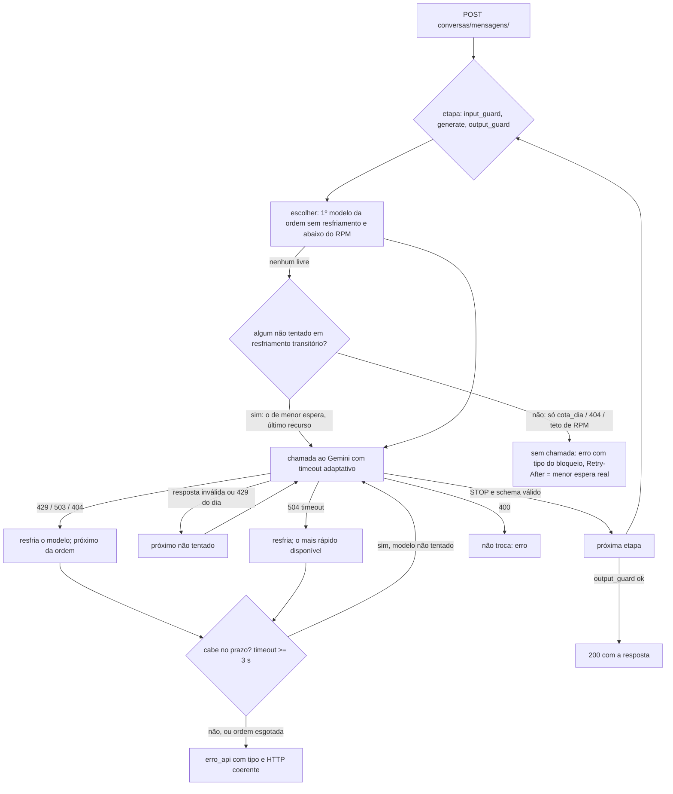

# Raiz rotativa das chamadas: rotação dos modelos Gemini por consumo

Como as chamadas do agente de conversa (`conversas/mensagens/`) são distribuídas entre os modelos Gemini da chave do
projeto, e porquê. Qualquer sessão que mexa em modelos segue esta lógica e altera **dados**, não código.

- Fonte de verdade: [`desafio_itau/politica/cotas-gemini-v1.json`](../desafio_itau/politica/cotas-gemini-v1.json)
  (1.0.0). Código que a lê: [`apps/conversas/roteador.py`](../apps/conversas/roteador.py); quem chama:
  `GeminiGateway._call_roteado` em [`apps/conversas/gateway.py`](../apps/conversas/gateway.py).
- Política de erros (quantas novas chamadas, o que o front recebe):
  [`desafio_itau/politica/erros_api-v1.json`](../desafio_itau/politica/erros_api-v1.json) 1.4.0.
- Criado em 2026-09-27 13:10 BRT (backend-22). Histórico: [`backend-unico-2026-09-27.md`](backend-unico-2026-09-27.md) §4.1-§4.2.

## 1. Consumo de um turno de conversa

Um turno = uma mensagem do usuário = **3 chamadas** no caminho feliz, mais no máximo 1 troca por etapa pelo router.

| etapa | chamadas | tokens medidos | latência medida (sucesso) | fonte · hora BRT |
|---|---|---|---|---|
| `input_guard` | 1 (+trocas, §4) | prompt 365-370, saída 44, pensamento 104-120, total 510-529 (gemini-3.1-flash-lite, n=4) | 1312-6172 ms; 1 timeout (>10 s) em 8 | sondas 12:58-13:21; status :8000 13:09 e :8013 |
| `generate` | 1 (+trocas, §4) | depois da abertura: prompt 8197-8726, pensamento 107-1026, saída 213-260, total 9046-9786 (gemini-3.1-flash-lite, n=3) | 2719-14938 ms (3.1-flash-lite); 1969 ms (3.5-flash-lite) | :8013 13:02-13:22; §4 11:44 |
| `output_guard` | 1 (+trocas, §4) | prompt 7670, pensamento 490 → cortado no teto antigo de 512 (3.1-flash-lite); total 8038 (3.6-flash) | 1640-1844 ms (3.6-flash); 3.1-flash-lite: 2 timeouts de 10 s em 3 | :8013 13:02-13:22 |

Com a abertura, o `generate` e o `output_guard` levam ~8-9 mil tokens de entrada; o `gemini-3.1-flash-lite` fica lento
(generate até 14,9 s, output_guard em timeout 2/3), e o turno medido às 13:22 levou **31,9 s** (5 chamadas). Teto de
saída (`maxOutputTokens`, que inclui o pensamento): guards 2048, generate 4096 (antes 512/1800; o 512 cortava o JSON).

Pior caso por turno: até 4 chamadas por etapa (uma por modelo da ordem), limitadas pelo prazo do turno. O teto de tempo é o do serviço, 45 s (`ConversationService.timeout`), abaixo dos 50 s
do front; o que passar disso sai 504 `timeout_provedor`.

**A conta que motivou a distribuição:** o limite por usuário é 6 mensagens/min; 3 chamadas × 6 msg/min = **18
chamadas/min > 15 RPM** do `gemini-3.5-flash-lite` (painel). Com tudo num só modelo, um único usuário ativo estoura o
RPM. Pondo os dois guards noutro modelo, o principal recebe 6/min (só o `generate`) e o `gemini-3.1-flash-lite`
recebe 12/min — ambos abaixo de 15. Além disso, às 12:39 o principal tinha **486/500** do RPD usado: os guards
consumiam 2/3 dessa cota.

## 2. Cota por modelo × papel

Painel AI Studio "Limites de taxa por modelo" (uso máximo dos últimos 28 dias / limite), colado pelo dono às 12:39 BRT.
**Não medido pelo backend** (a API não expõe cota restante). IDs confirmados por `GET v1beta/models` às 12:40 BRT.

| modelo (ID) | RPM uso/limite | TPM uso/limite | RPD uso/limite | papel | por quê |
|---|---|---|---|---|---|
| gemini-3.5-flash-lite | 16/15 | 92.290/250.000 | 486/500 | 1º no `generate` | modelo principal homologado; p50 1250 ms (n=34) |
| gemini-3.1-flash-lite | 1/15 | 7/250.000 | 1/500 | 1º nos guards; 2º no `generate` | cota livre, mesmo RPM/RPD do principal; sonda 200 |
| gemini-3.6-flash | 0/5 | 0/250.000 | 0/20 | 2º nos guards; 3º no `generate` | sonda 200 em 1375 ms (o mais rápido): destino de timeout |
| gemini-3.5-flash | 3/5 | 17.600/250.000 | 19/20 | último em todas | contingência antiga; parou até o timeout (3/3) antes do 429 |

## 3. Ordem por etapa e como alterá-la

```json
"input_guard":  ["gemini-3.1-flash-lite", "gemini-3.6-flash", "gemini-3.5-flash-lite", "gemini-3.5-flash"],
"output_guard": ["gemini-3.1-flash-lite", "gemini-3.6-flash", "gemini-3.5-flash-lite", "gemini-3.5-flash"],
"generate":     ["gemini-3.5-flash-lite", "gemini-3.1-flash-lite", "gemini-3.6-flash", "gemini-3.5-flash"]
```

Mudar a ordem = editar `router.etapas` no JSON. O carregador (`roteador.validar`) recusa etapa sem ordem e modelo
com `apto: false` (prova negativa em `tests/test_roteador_e_erros_tipo.py`). O processo lê o ficheiro uma vez: depois de
alterar, reinicie o servidor.

**Adicionar um modelo:**

1. Confirmar o ID em `GET https://generativelanguage.googleapis.com/v1beta/models` (tem de listar `generateContent`).
2. Sondar com o **corpo real** de cada etapa (system_instruction + `responseJsonSchema` + `thinkingConfig`): 1 chamada.
   Guardar http, latência e nota em `modelos.<id>.sonda`. Conferir que a saída **valida** no schema estrito
   (`GuardDecisionV1` / `AgentDraftV1`), não só que é JSON: o `gemini-3.1-flash-lite` devolvia JSON bem formado com
   `policy_version` errado.
3. Copiar os números do painel para `modelos.<id>.painel` com a hora; `latencia_ref_ms` = latência medida.
4. `apto: true` só com sonda 200 e schema válido; incluir o ID em `router.etapas`.
5. Rodar a suíte (`.venv/Scripts/python -m unittest discover -s tests`). O router não consulta `ALLOWED_MODELS` do
   gateway (`MODELOS_GOOGLE` em `desafio_itau/modelos_llm.py`); essa lista só vale para o caminho sem router
   (`CONVERSAS['ROTEADOR']=False` e a rota `interacao/`).

**Retirar um modelo:** tirá-lo de `router.etapas` e pôr `apto: false` com a nota medida (não apagar a entrada).

## 4. Regras por erro

| o que aconteceu | próxima ação | resfriamento do modelo | o front recebe (se ninguém responder) |
|---|---|---|---|
| 429 cota diária (`quotaId` …PerDay…) | próximo da ordem não tentado | 900 s, **exclui** | HTTP 429 `cota_provedor`, `Retry-After` = menor espera real da etapa; todos sem cota do dia: `motivo_provedor: "cota_dia"` |
| 429 cota por minuto | próximo da ordem não tentado | `retryDelay` do Google (60 s se não vier), transitório | idem |
| 503 / 5xx | próximo da ordem não tentado | 15 s, transitório (só despromove) | HTTP 503 `provedor_indisponivel` |
| 504 / timeout local (adaptativo, ver abaixo) | o de menor latência mediana da etapa (`capacidades`; sem medida, `latencia_ref_ms`) | 15 s, transitório | HTTP 504 `timeout_provedor` |
| 404 (modelo retirado) | próximo da ordem | 3600 s | HTTP 503 `provedor_indisponivel` |
| 400 (pedido nosso inválido) | **não troca** | nenhum | HTTP 503 |
| resposta inválida do modelo: HTTP 200 com finishReason ≠ STOP (ex.: MAX_TOKENS), JSON inválido ou fora do schema | próximo da ordem ainda não tentado | nenhum | HTTP 503 `resposta_modelo_invalida` (linha 503) |

- **Troca pela ordem dentro do prazo (erros_api 1.4.0, `limites.troca_de_modelo_no_turno = "ordem_no_prazo"`, pedido
  do dono 12:39):** em 429/503/5xx/404/timeout o router segue para o **próximo modelo ainda não tentado** da ordem da
  etapa, quantas vezes couber no prazo do turno (a 1.3.0 parava depois de 1 nova chamada: foi o 503 do dono às 13:35,
  com ~18 s livres). O **mesmo modelo nunca é chamado duas vezes na mesma etapa**; 400 continua sem troca. Resposta
  inválida do modelo e 429 de cota diária também seguem para o próximo não tentado. `novas_chamadas_max` (1) só vale
  com `"uma"`.
- **Timeout adaptativo por tentativa** (`gateway.timeout_da_tentativa`): o serviço marca `PRAZO_TURNO` = início + 45 s;
  cada tentativa usa `min(teto da etapa, prazo restante − reserva das etapas seguintes)`. Tetos: input_guard 10 s,
  generate 20 s, output_guard 20 s. Reservas: depois do input_guard 18 s (generate 10 + output_guard 6 + resposta 2),
  depois do generate 8 s, depois do output_guard 2 s. Uma troca só começa se a tentativa tiver **≥ 3 s**; senão sai o
  erro da tentativa anterior com o tipo dele (504 `timeout_provedor`, 503 `provedor_indisponivel`…). Sem prazo (testes,
  rota interacao/) valem os tetos fixos antigos 10/15/10 s. Visível em `status.limites.timeout_adaptativo`.
- **Números que motivaram** (métricas da :8000, 13:35:26 BRT): input_guard 3.1-flash-lite ok 6375 ms; generate
  3.1-flash-lite ok 9297 ms; output_guard 3.1-flash-lite TimeoutError 10078 ms (teto fixo 10 s) -> 3.6-flash 503 em
  1156 ms -> fim com 503. Com 1.4.0 a mesma sequência dá ao output_guard ~20 s na 1ª tentativa (15,7 s gastos) e, se
  ainda assim falhar, segue ao 3º modelo enquanto houver ≥ 3 s (teste `tests/test_troca_no_prazo.py`).
- **Não feito:** reduzir o contexto do output_guard (7-9 mil tokens de entrada). Exige prova de que número sem fonte ou
  afirmação proibida continuam reprovados; ficou fora desta correção. NAO_MEDIDO o ganho de latência.
- Modelo em resfriamento é **pulado sem chamada** (não gasta orçamento nem latência). Todos bloqueados: nenhuma
  chamada e o erro com o tipo do bloqueio (cota → 429).
- **Contador de RPM do processo:** cada chamada real entra numa janela de 60 s por modelo; com `RPM do painel − 1`
  (`rpm_margem`) chamadas na janela, o modelo é tratado como sem cota e o router desvia **antes** do 429. Vale só
  para este processo (dois processos com a mesma chave não se veem).
- **Auditar:** `GET /api/v1/context-agent/conversas/status/` →
  `roteador.ordem_por_etapa`, `roteador.ultimo_modelo_por_etapa` (todas as etapas; null = nenhuma resposta válida),
  `roteador.ultima_tentativa_por_etapa {modelo, resultado}` (inclui falha: `429:dia`, `resposta_invalida:MAX_TOKENS`…),
  `roteador.proximo_por_etapa`, `roteador.resfriamentos {modelo: {restam_s, motivo}}`,
  `roteador.rpm_no_processo`, `cota_diaria_esgotada`, `ultimas_chamadas[] {stage, model, model_version, latency_ms,
  outcome, total_tokens, nova_chamada, tratamento_erro, error_type, motivo_invalida, http_status}`.



### 4.1 Capacidades por modelo (cotas-gemini-v1.json 1.1.0, pedido do dono 14:11 BRT)

Bloco `capacidades` por modelo apto, validado por schema estrito e **lido pelo router** (não decorativo):

| campo | o que diz | quem lê |
|---|---|---|
| `limites.rpm/tpm/rpd` `{valor, fonte, estado}` | painel AI Studio 12:39 BRT, `observado` (`NAO_MEDIDO` = valor null) | `rpm` → teto de RPM do processo (`rpm − rpm_margem`) |
| `etapas {etapa: porquê}` | que etapas serve e porquê | `validar`: modelo na ordem de uma etapa sem a declarar reprova |
| `pensamento {emite, fonte}` | 3.1-flash-lite `sim` (490 tokens de pensamento, 13:15); os outros `NAO_MEDIDO` | doc |
| `max_output_tokens {guard, generate}` | 2048 / 4096 (o teto inclui o pensamento) | `gateway._max_tokens` |
| `timeout_s {etapa}` | 10 / 20 / 20 s | teto da tentativa em `timeout_da_tentativa` |
| `latencia_mediana_ms {etapa: {valor_ms, n, fonte, estado}}` | mediana das chamadas `complete` (abaixo) | escolha do mais rápido depois de timeout |
| `falhas_observadas` | modos de falha vistos hoje | doc / status |

Medianas (chamadas `complete` em `ultimas_chamadas`: :8000 lida 14:15 BRT, :8013 13:21 e 14:09, :8000 13:35):

| modelo | input_guard | generate | output_guard | falhas observadas |
|---|---|---|---|---|
| gemini-3.1-flash-lite | 1430 ms (n=6) | 3672 ms (n=5) | 6906 ms (n=2) | output_guard em timeout de 10 s em 4 de 6 tentativas; MAX_TOKENS com teto 512 |
| gemini-3.6-flash | 2234 ms (n=1) | 3500 ms (n=1) | 2086 ms (n=4) | 503 em rajada (1156, 2062, 1219 ms) |
| gemini-3.5-flash-lite | NAO_MEDIDO | NAO_MEDIDO | NAO_MEDIDO | 429 de cota diária (13:21, 14:09; painel 486/500 RPD) |
| gemini-3.5-flash | NAO_MEDIDO | NAO_MEDIDO | NAO_MEDIDO | 429 de cota diária (painel 19/20 RPD); antes, parado até 15 s |

n<3 é indicativo, não mediana estável. Estado vivo em `GET conversas/status/` → `roteador.capacidades.<modelo>.agora`
`{estado: livre|resfriando, motivo, restam_s, transitorio, rpm_usado, rpm_limite_processo}`.

### 4.2 O que acontece quando…

| caso (visto) | causa | o que o backend faz agora | o front recebe | teste |
|---|---|---|---|---|
| texto de falha entrava no histórico (frontend-c7, 14:09) | `_send` guardava a resposta de falha como fala do modelo, que ia ao Gemini nos turnos seguintes | turno com `erro_api` fica marcado `falha` (também na persistência); não vai ao modelo; continua a contar para `max_turns`; cache por `client_message_id` igual | o mesmo erro; o turno seguinte é limpo | `test_capacidades_e_bloqueio.HistoricoSemFalha` |
| input_guard sem modelo às 13:40/14:07 com 3.6-flash/3.1-flash-lite a recuperar | timeout (60 s) e 503 (30 s) resfriavam como se fossem cota; todos bloqueados → `sem_modelo_disponivel` → 429 | timeout/5xx/429 por minuto resfriam 15 s e só despromovem; todos bloqueados → **último recurso**: o não tentado de menor espera transitória; cota_dia e 404 excluem de fato | 200 quando o último recurso responde | `UltimoRecurso`, `ResfriamentoTransitorio` |
| "tente em 30 s" com os modelos livres só daqui a ~14 min | `tentar_novamente_em_s` era o fixo da linha da política | `Retry-After` / `erro_api.tentar_novamente_em_s` = menor espera real entre os modelos da etapa; `erro_api.motivo_provedor` (`cota_dia` quando todos estão sem cota do dia) | 429 `cota_provedor`, `Retry-After: <s reais>`, `motivo_provedor` | `EsperaReal` |
| 429 por minuto | cota por minuto do modelo | resfria pelo `retryDelay`; próximo não tentado | 200, ou 429 `cota_provedor` com a espera real | `test_resposta_invalida_e_abertura` (`test_429_por_minuto_depois_de_timeout_segue_a_ordem`) |
| 5xx / timeout (13:35: timeout no 1º, 503 no 2º) | provedor lento/fora; teto fixo 10 s; 1.3.0 parava após 1 nova chamada | timeout adaptativo + próximo não tentado enquanto couber no prazo | 200 se algum responde; senão 503 `provedor_indisponivel` / 504 `timeout_provedor` | `test_troca_no_prazo.CasoDoDono1335` |
| 400 | pedido nosso inválido | não troca, não resfria | 503 | `test_prova_negativa_400_nao_troca`, `ProvaNegativa.test_400_nao_troca_mesmo_com_prazo` |
| prazo do turno esgotado | < 3 s para a próxima tentativa | sai o erro da última tentativa, sem nova chamada | 504 `timeout_provedor` ou 503 `provedor_indisponivel` | `ProvaNegativa.test_prazo_esgotado_*` |
| modelo perto do teto de RPM | contador do processo (janela 60 s) | desvia antes do 429; não entra no último recurso | — | `UltimoRecurso.test_d_teto_de_rpm_desvia_antes_e_nao_e_ultimo_recurso` |
| **live :3000 14:25 BRT (284b7b2), turno 1 → 504 aos 45,2 s** | generate 3.5-flash-lite 429 dia (547 ms) → 3.1-flash-lite 503 depois de **15782 ms** (mediana 3672) → 3.6-flash 503 (3515 ms) → 3.5-flash ok (7735 ms); output_guard 3.1-flash-lite timeout 6046 ms e sem prazo | teto de CADA tentativa = min(`timeout_s` da etapa, max(6 s, 3 × mediana medida do modelo na etapa)) (`roteador.teto_tentativa`; `router.teto_fator_mediana`/`teto_piso_s`); mediana NAO_MEDIDO → `timeout_s`. 3.1-flash-lite no generate: 11 s em vez de 20; guards: 6 s | 200 se o 3º/4º modelo responde no prazo | `Live1425.test_1_*` |
| idem, output_guard começava no mais lento | ordem fixa com 3.1-flash-lite (6906 ms, 4/6 timeouts) antes de 3.6-flash (2086 ms, n=4) | **escolha: mudar a ordem nos dados** (`cotas-gemini-v1.json` 1.2.0, output_guard = 3.6-flash, 3.1-flash-lite, 3.5-flash-lite, 3.5-flash) e validar com `router.ordem_por_latencia` — a ordem fica auditável no ficheiro e no status, e uma promoção automática com n=1-4 oscilaria. Custo: 3.6-flash tem 20 RPD; esgotado, cai em cota_dia e o 3.1-flash-lite volta a ser o 1º | — | `Live1425.test_2_output_guard_segue_a_latencia_medida` (ordem de 1.1.0 reprova) |
| idem, turno 2 → 429 com `motivo_provedor: "timeout"`, `tentar_novamente_em_s: 10` e texto "cerca de 30 segundos" | o motivo era o do modelo de menor espera (não o do erro); a mensagem usava a espera fixa da linha | `motivo_provedor` = motivo do erro da ÚLTIMA tentativa (`gateway.motivo_do_erro`: 429 → cota_dia/cota_minuto; 5xx → indisponivel; 504 → timeout); sem chamada, só motivos que dão o status (429 → cota_*/rpm_processo); `erro_api(…, espera_s=)` põe o MESMO número no campo e na mensagem | 429 `cota_provedor`, `motivo_provedor: "cota_dia"`, `tentar_novamente_em_s` = N e mensagem "cerca de N segundos" | `Live1425.test_3_*` |

## 5. Modelos excluídos (medido)

| modelo | motivo · hora BRT |
|---|---|
| gemini-3-flash-preview | 200, mas 14.937 ms: acima do timeout de guard (10 s) · 12:41 |
| gemini-3.7-flash | 503 UNAVAILABLE depois de 26 s · 12:42 |
| gemini-flash-latest (serve gemini-3.8-flash) | 429 cota diária; painel 26/20 RPD · 12:31 |
| gemini-2.5-flash-lite, gemini-2.5-flash | listados em /models, mas `generateContent` 404 · 12:41 |
| gemma-4-26b-a4b-it, gemma-4-31b-it | 400 com o corpo real (system_instruction/schema/thinking); TPM 16.000 · 12:42 |
| Gemini 2 Flash, 2 Flash Lite, 2.5 Pro, 3.1 Pro | sem cota no painel |

## 6. Limites e decisões pendentes

- **Cota diária × "aguarde 30 s" (decisão do dono):** com todos sem cota do dia, o front ouve "aguarde 30 s", mas a
  cota volta à meia-noite do Pacífico (≈04:00 BRT, NAO_MEDIDO). Opções: linha própria na política para cota diária;
  chave paga ou separada por processo.
- **gemini-3.1-flash-lite com contexto grande** (8-9 mil tokens depois da abertura): generate até 14,9 s e output_guard
  em timeout 2/3 (13:02-13:22). O turno fica em 24-32 s, dentro dos 45 s, mas sem folga para uma terceira troca. Opções
  (dono): pôr `gemini-3.6-flash` antes no `output_guard` (1,6-1,8 s, mas 5 RPM / 20 RPD), ou reduzir o contexto enviado
  ao output_guard. Não alterado.
- O contador de RPM e os resfriamentos vivem na memória do processo: zeram ao reiniciar.
- Latência e tokens do `output_guard` e do `generate` com sucesso: amostras de n=1; NAO_MEDIDO em carga.
